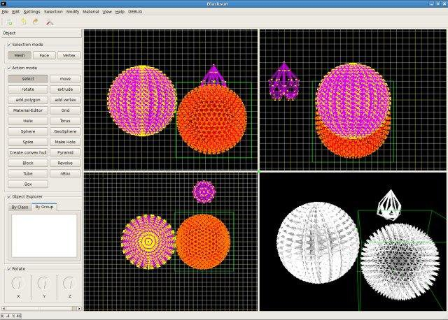
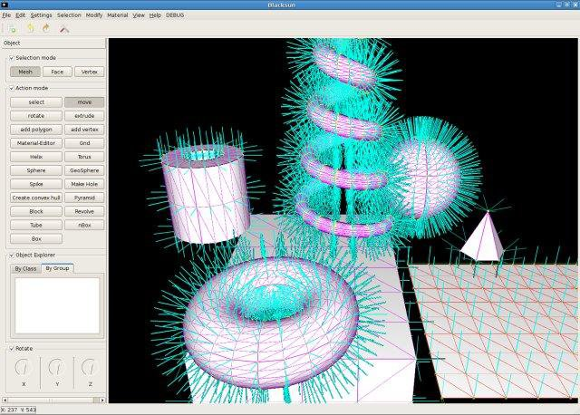
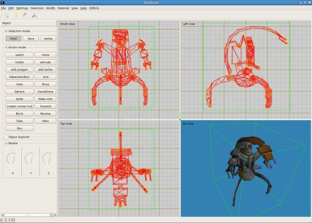
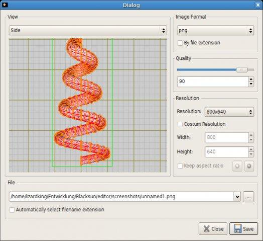
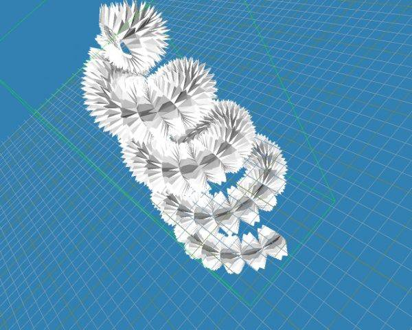
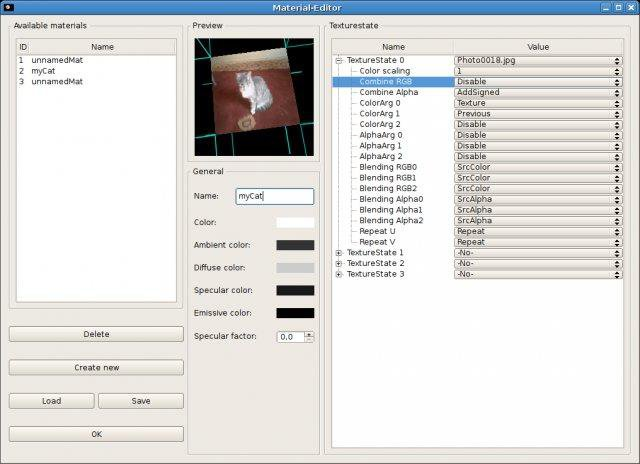

# Blacksun 3D Modeler

Blacksun is a free 3D modeling software for static objects.

## Authors

-  Philipp Gruber        
-  Reinhard Jeschull      
-  Stefan Zeltner         
-  Thomas Kuhndörfer     
-  Thomas Tischler   

## Technologies

- Code language: C++
- Platforms: Linux, Windows
- Libraries: Qt, OpenGL
- License: GPL

## Editor views

### GUI customized with dark schema

### Scene with built in objects showing their normals

### GUI with loaded MD2 model

### Screenshot module

### Spike modificator

### Material editor

